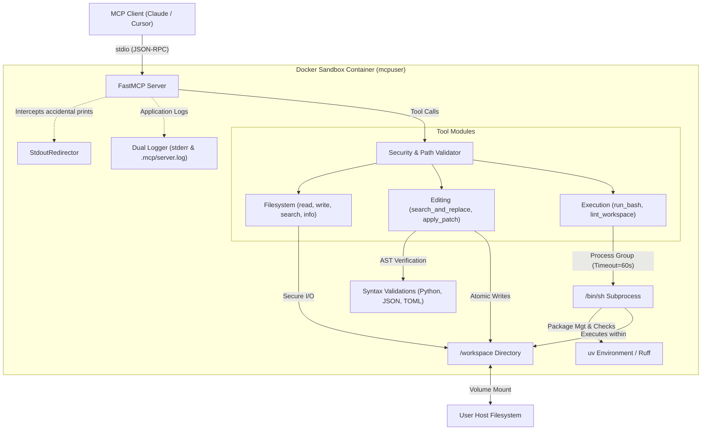

# 🛡️ Agent Workspace MCP Server

[](https://github.com/HrRodan/agent-workspace-mcp/actions/workflows/ci.yml)
[](https://opensource.org/licenses/MIT)
[](https://www.python.org/downloads/release/python-3140/)

A unified Model Context Protocol (MCP) server providing a **highly secure, containerized workspace** for Large Language Models (LLMs). It acts as an isolated "agentic playground" where agents can autonomously code, test, and debug without risking the host machine.

---

## ✨ Features

- **🏗️ Full Project Lifecycle**: Bootstrap projects with `uv init`, manage dependencies with `uv add`, and execute via `uv run`.
- **🐚 Secure Bash Access**: Execute shell commands with mandatory timeouts and merged output streams.
- **📂 Robust Filesystem**: Path-traversal protected operations for reading, writing, and searching the workspace.
- **🛡️ Multi-Layer Security**: Non-root execution, dropped capabilities, resource limits, and a read-only root filesystem.
- ⚡ **Precision Editing**: Advanced `search_and_replace` with **fuzzy whitespace matching**, **indentation preservation**, dry-run support, and syntax validation for Python, JSON, TOML, and YAML.
- 🩹 **Standard Unified Diffs**: Receive rich diff output with 3 lines of context or apply standard `.patch` files via `patch -p1`.
- **📊 Real-time Observability**: Direct logging to MCP client UI and persistent rotating audit logs.

---

## 🏗️ Architecture



---

## 📦 Quick Start

### 1. Pull or Build the Docker Image
```bash
# Pull from GHCR
docker pull ghcr.io/hrrodan/agent-workspace-mcp:latest

# OR: Build locally with your host's UID/GID for optimal permissions
docker build --build-arg UID=$(id -u) --build-arg GID=$(id -g) -t agent-workspace-mcp .
```

### 2. Programmatic Usage (OpenAI Agents SDK)
Here is a quick boilerplate showing how to use the containerized workspace programmatically using the standard `openai-agents` SDK:

```python
import asyncio
from agents import Agent, Runner
from agents.mcp import MCPServerStdio

async def main():
    # 1. Configure the MCP Server to run via Docker
    server = MCPServerStdio(
        name="Sandboxed Workspace",
        params={
            "command": "docker",
            "args": [
                "run", "-i", "--rm", "--init",
                "--memory=2g", "--cpus=2.0",
                "--pids-limit=256",
                "--cap-drop=ALL", "--security-opt=no-new-privileges:true",
                "--read-only",
                "--tmpfs", "/tmp:size=64m",
                "--tmpfs", "/home/mcpuser/.cache:size=512m",
                "--user", "1000:1000", # Replace with your host UID:GID
                "-v", "/path/to/your/projects:/workspace",
                "ghcr.io/hrrodan/agent-workspace-mcp:latest",
            ],
        },
        client_session_timeout_seconds=60.0,
    )

    # 2. Attach server to the Agent and load the skill instructions (optional)
    with open("skills/agent-workspace-mcp/SKILL.md", "r") as f:
        skill_instructions = f.read()

    agent = Agent(
        name="WorkspaceAgent",
        instructions=f"You are a coding agent with access to a secure workspace.\n\n{skill_instructions}",
        mcp_servers=[server],
    )

    # 3. Execute a workflow
    async with server:
        result = await Runner.run(
            agent, 
            "Create a python script in the workspace to print the first 10 Fibonacci numbers, then run it."
        )
        print(f"Agent's Final Output:\n{result.final_output}")

if __name__ == "__main__":
    asyncio.run(main())
```

### 3. Use with MCP Clients (Claude / Cursor)
Add the following configuration to your `claude_desktop_config.json` or Cursor settings.

```json
{
  "mcpServers": {
    "agent-workspace-mcp": {
      "command": "docker",
      "args": [
        "run", "-i", "--rm", "--init",
        "--memory=2g", "--cpus=2.0",
        "--pids-limit=256",
        "--cap-drop=ALL", "--security-opt=no-new-privileges:true",
        "--read-only",
        "--tmpfs", "/tmp:size=64m",
        "--tmpfs", "/home/mcpuser/.cache:size=512m",
        "--user", "1000:1000",
        "-v", "/path/to/your/projects:/workspace",
        "ghcr.io/hrrodan/agent-workspace-mcp:latest"
      ]
    }
  }
}
```

> [!IMPORTANT]
> **Linux Users:** Replace `1000:1000` with your actual UID:GID (run `id -u` and `id -g`). Claude Desktop does not expand environment variables.
> **Signal Handling:** The `--init` flag is essential for proper signal forwarding and zombie process reaping.

---

## 🛠️ Tool Reference

| Tool | Description |
|---|---|
| `read_file` | Read text files with optional `offset` and `limit` (default: 100 lines). |
| `write_file` | Create or overwrite files (atomic write). |
| `list_directory` | List contents with `[F]`ile and `[D]`irectory prefixes. |
| `search_workspace` | Find files by glob pattern with support for `exclude_patterns`. |
| `run_bash` | Execute shell commands in `/workspace` with a 60s timeout. |
| `apply_patch` | Apply standard Unified Diffs (`.patch` files) via `patch -p1`. |
| `search_and_replace` | Multi-edit tool with **fuzzy whitespace matching**, **indentation preservation**, dry-run mode, and syntax validation. |

---

## ⚙️ Configuration

The server supports the following environment variables (passed via Docker `--env`):

| Variable | Default | Description |
|---|---|---|
| `WORKSPACE_ROOT` | `/workspace` | Root directory for all sandboxed operations. |
| `COMMAND_TIMEOUT` | `60` | Default seconds before `run_bash` kills a process. |
| `MAX_SEARCH_RESULTS` | `50` | Maximum results returned by `search_workspace`. |
| `MAX_READ_SIZE_BYTES` | `1048576` | Maximum file size for `read_file` (1MB). |
| `LOG_LEVEL` | `INFO` | Python logging level (DEBUG, INFO, etc.). |

---

## 🛡️ Security Model

This server is designed with a **defense-in-depth** strategy, providing multiple layers of isolation and protection:

### 🐋 Container-Level Security
- **Configurable Non-Root Identity**: The container runs under a dedicated `mcpuser`. By default, it uses UID 1000, but this is [customizable at build time](#1-pull-or-build-the-docker-image) to match your host user, preventing permission conflicts on volume mounts.
- **Kernel Hardening**: All Linux capabilities are dropped (`--cap-drop=ALL`).
- **Privilege Lockdown**: Prevents processes from gaining new privileges (`no-new-privileges:true`).
- **Immutable Core**: The root filesystem is mounted **read-only** (`--read-only`).
- **Standardized Metadata**: Adheres to the [OCI Image Specification](https://github.com/opencontainers/image-spec) for transparent auditing and discovery.
- **Resource Quotas**: Hard limits on CPU, Memory, and PIDs prevent fork-bombs and host exhaustion.
- **Ephemeral Sessions**: Containers are strictly ephemeral (`--rm`), ensuring no state survives between connections.

### 🛡️ Application-Level Security
- **Path Guard**: Strict boundary enforcement prevents path traversal attacks outside `/workspace`.
- **Command Control**: Mandatory timeouts (default 60s) and process group isolation capture and kill orphan processes.
- **AST Validation**: `search_and_replace` validates Python, JSON, and TOML syntax in-memory before writing any changes.
- **Atomic Operations**: File edits use temp-and-move logic to prevent filesystem corruption during power-loss or crashes.
- **Size Enforcement**: Hard limits on file reads (1MB) and command outputs (50KB) protect against memory-overload attacks.

### 📊 Observability & Auditing
- **Real-time Logging**: All tool invocations are logged directly to the MCP client for immediate operator visibility.
- **Sanitized Errors**: Internal system paths and stack traces are suppressed in tool outputs to prevent information leakage.
- **Search Exclusions**: High-noise or sensitive directories (`.git`, `.venv`) are automatically excluded from search tools.

---

## 🤝 Contributing

1. **Install Dev Dependencies**: `uv sync`
2. **Run Linting**: `uv run ruff check .`
3. **Run Unit Tests**: `uv run pytest tests/ --ignore=tests/integration/`
4. **Run Integration Tests**: Set `OPENROUTER_API_KEY` and run `uv run pytest tests/integration/`

---
&copy; 2026 HrRodan. Licensed under [MIT](LICENSE).
