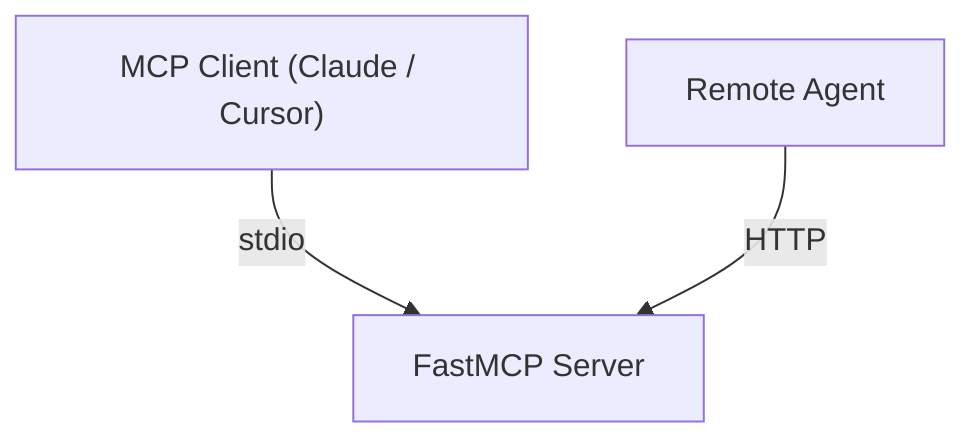

# Phase A: HTTP Transport with Bearer Token Auth

This document contains the exact implementation steps to add HTTP Streamable transport support to the Agent Workspace MCP server. 

**Goals:**
1. Support `MCP_TRANSPORT=http` (default remains `stdio`).
2. Enforce Bearer token authentication via `MCP_API_KEY` for all HTTP connections.
3. Preserve 100% backwards compatibility for existing stdio users.
4. Maintain the OS-level security boundaries of the container.

---

## 1. Security Configuration

**File:** `src/agent_workspace_mcp/utils/security.py`

Add the new configuration variables below the existing `LOG_LEVEL` variable (around line 15):

```python
LOG_LEVEL: str = os.environ.get("LOG_LEVEL", "INFO")

# HTTP Transport Configuration
MCP_TRANSPORT: str = os.environ.get("MCP_TRANSPORT", "stdio")
MCP_HOST: str = os.environ.get("MCP_HOST", "0.0.0.0")
MCP_PORT: int = int(os.environ.get("MCP_PORT", "8000"))
```

---

## 2. Server Core & Authentication

**File:** `src/agent_workspace_mcp/server.py`

### 2.1 Conditional StdoutRedirector

Change the unconditional redirection at the top of the file to be conditional based on the transport. In HTTP mode, Uvicorn handles IO and redirecting stdout breaks normal logging.

```python
# Before
sys.stdout = StdoutRedirector(sys.stdout)

# After
if security.MCP_TRANSPORT == "stdio":
    sys.stdout = StdoutRedirector(sys.stdout)
```

### 2.2 Bearer Auth Middleware

Add the following classes and imports above `setup_logging`:

```python
from fastmcp.server.middleware import Middleware, MiddlewareContext
from fastmcp.server.dependencies import get_http_headers
from fastmcp.exceptions import ToolError

class BearerAuthMiddleware(Middleware):
    """Enforces Bearer token authentication for all tool calls in HTTP mode."""
    def __init__(self, token: str):
        self.token = token

    async def on_call_tool(self, context: MiddlewareContext, call_next):
        headers = get_http_headers() or {}
        # Uvicorn and fastmcp lowercase all headers
        auth_header = headers.get("authorization", "")
        
        if not auth_header.startswith("Bearer ") or auth_header[7:] != self.token:
            raise ToolError("Unauthorized: Invalid or missing API key")
            
        return await call_next(context)
```

### 2.3 Update `main()` function

Modify `main()` to check the transport and attach the auth middleware.

```python
def main() -> None:
    """Entry point for the Agent Workspace MCP server."""
    setup_logging()
    logger = logging.getLogger(__name__)
    
    logger.info("Agent Workspace MCP server starting (transport=%s)...", security.MCP_TRANSPORT)
    logger.info("Workspace root: %s", security.WORKSPACE_ROOT)
    logger.info("Log level: %s", security.LOG_LEVEL)

    if security.MCP_TRANSPORT == "http":
        api_key = os.environ.get("MCP_API_KEY")
        if not api_key:
            logger.error("MCP_API_KEY must be set when running in HTTP mode.")
            sys.exit(1)
        
        # Attach the auth middleware
        mcp.add_middleware(BearerAuthMiddleware(api_key))
        
        logger.info("HTTP endpoint: http://%s:%d/mcp/", security.MCP_HOST, security.MCP_PORT)
        # Note: streamable-http is FastMCP's recommended default for HTTP
        mcp.run(transport="streamable-http", host=security.MCP_HOST, port=security.MCP_PORT)
    else:
        # Default stdio transport
        mcp.run()

if __name__ == "__main__":
    main()
```

---

## 3. Dockerfile

**File:** `Dockerfile`

Add the `EXPOSE` instruction and update the comment header.

```dockerfile
# Around line 5
# Transport:    stdio (default) or HTTP (via MCP_TRANSPORT=http)

# Around line 120 (before the ARG VERSION block)
# Expose HTTP transport port (only used when MCP_TRANSPORT=http)
EXPOSE 8000
```

---

## 4. Documentation

**File:** `README.md`

### 4.1 Update Architecture Diagram
Change the top of the mermaid diagram (around line 25):



### 4.2 Update Configuration Table
Add the new variables (around line 177):

| Variable | Default | Description |
|---|---|---|
| `MCP_TRANSPORT` | `stdio` | Transport mode: `stdio` or `http`. |
| `MCP_HOST` | `0.0.0.0` | HTTP bind address (only used when `MCP_TRANSPORT=http`). |
| `MCP_PORT` | `8000` | HTTP listen port (only used when `MCP_TRANSPORT=http`). |
| `MCP_API_KEY` | — | **Required** for HTTP mode. Bearer token for authentication. |

### 4.3 Add Remote HTTP Usage Section
Add this section before "Tool Reference":

```markdown
### 4. Remote HTTP Usage (Single-Tenant)

You can run the server as a standalone HTTP API. **Auth is mandatory.**

> [!WARNING]
> **Single-tenant only.** HTTP mode shares a single `/workspace` across all connections. Do not expose this concurrently to multiple independent agents without an external orchestrator.

```bash
# Generate a random API key
export MCP_API_KEY=$(python3 -c "import secrets; print(secrets.token_urlsafe(32))")

# Run the server in HTTP mode
docker run -d --rm --init \
  --name agent-workspace-http \
  --memory=2g --cpus=2.0 --pids-limit=256 \
  --cap-drop=ALL --security-opt=no-new-privileges:true \
  --tmpfs /tmp:size=64m \
  --tmpfs /home/mcpuser/.cache:size=512m \
  --user 1000:1000 \
  -v /path/to/your/projects:/workspace \
  -p 8000:8000 \
  -e MCP_TRANSPORT=http \
  -e MCP_API_KEY="$MCP_API_KEY" \
  ghcr.io/hrrodan/agent-workspace-mcp:latest
```

**Connect using the OpenAI SDK:**
```python
from openai import OpenAI

client = OpenAI()
resp = client.responses.create(
    model="gpt-4.1",
    tools=[{
        "type": "mcp",
        "server_label": "workspace",
        "server_url": "http://localhost:8000/mcp/",
        "require_approval": "never",
        "headers": {"Authorization": f"Bearer {YOUR_API_KEY}"},
    }],
    input="List the workspace contents.",
)
print(resp.output_text)
```
```

---

## 5. Testing

### 5.1 Unit Tests

**File:** `tests/test_server_http.py`

Create a new file to mock and test the transport logic:

```python
import os
import pytest
from unittest.mock import patch, MagicMock

@patch("agent_workspace_mcp.server.mcp.run")
def test_main_defaults_to_stdio(mock_run):
    with patch.dict(os.environ, clear=True):
        from agent_workspace_mcp.server import main
        main()
        mock_run.assert_called_once_with()

@patch("agent_workspace_mcp.server.mcp.run")
def test_main_http_transport(mock_run):
    with patch.dict(os.environ, {"MCP_TRANSPORT": "http", "MCP_API_KEY": "test-key"}):
        from agent_workspace_mcp.server import main
        main()
        mock_run.assert_called_once_with(transport="streamable-http", host="0.0.0.0", port=8000)

def test_main_http_requires_api_key():
    with patch.dict(os.environ, {"MCP_TRANSPORT": "http"}, clear=True):
        from agent_workspace_mcp.server import main
        with pytest.raises(SystemExit):
            main()

@pytest.mark.asyncio
async def test_bearer_auth_middleware_valid():
    from agent_workspace_mcp.server import BearerAuthMiddleware
    from fastmcp.server.middleware import MiddlewareContext
    
    middleware = BearerAuthMiddleware("secret123")
    context = MagicMock(spec=MiddlewareContext)
    
    call_next = AsyncMock()
    
    with patch("agent_workspace_mcp.server.get_http_headers", return_value={"authorization": "Bearer secret123"}):
        await middleware.on_call_tool(context, call_next)
        call_next.assert_called_once_with(context)

@pytest.mark.asyncio
async def test_bearer_auth_middleware_invalid():
    from agent_workspace_mcp.server import BearerAuthMiddleware
    from fastmcp.exceptions import ToolError
    
    middleware = BearerAuthMiddleware("secret123")
    context = MagicMock()
    call_next = AsyncMock()
    
    with patch("agent_workspace_mcp.server.get_http_headers", return_value={"authorization": "Bearer wrong"}):
        with pytest.raises(ToolError, match="Unauthorized"):
            await middleware.on_call_tool(context, call_next)
```

*(Note: Ensure `AsyncMock` is imported from `unittest.mock`)*

### 5.2 Container Integration Tests

**File:** `tests/container/conftest.py`

Add an HTTP client fixture using `httpx` (add `httpx` to `pyproject.toml` dev dependencies if not present).

```python
@pytest.fixture
async def mcp_http_client(tmp_path):
    """Provide an HTTP client connected to the MCP container."""
    import httpx
    
    # Start container with -p 8000:8000 and -e MCP_TRANSPORT=http -e MCP_API_KEY=test-key
    # (Implementation mirrors MCPContainerClient but uses HTTP)
    # ...
```

**File:** `tests/container/test_http_transport.py`

Create a new file to verify container behavior over HTTP:

```python
import pytest
import httpx

@pytest.mark.asyncio
async def test_http_auth_required(mcp_http_client):
    # Send request without Auth header
    async with httpx.AsyncClient() as client:
        res = await client.post("http://localhost:8000/mcp/", json={...})
        assert res.status_code in (401, 403, 500) # FastMCP may wrap the ToolError in a 500 JSON-RPC response or 401 HTTP

@pytest.mark.asyncio
async def test_http_tool_call_success(mcp_http_client):
    # Send request with Bearer test-key
    # Verify tool executes
```

---

## 6. Execution Order

1. Apply `security.py` changes.
2. Apply `server.py` changes.
3. Apply `Dockerfile` changes.
4. Run `uv run pytest tests/test_server_http.py` (once created) to verify logic.
5. Build container `docker build -t agent-workspace-mcp .`
6. Run `uv run pytest tests/container` to ensure stdio still works.
7. Implement HTTP container tests and run them.
8. Apply `README.md` updates.
