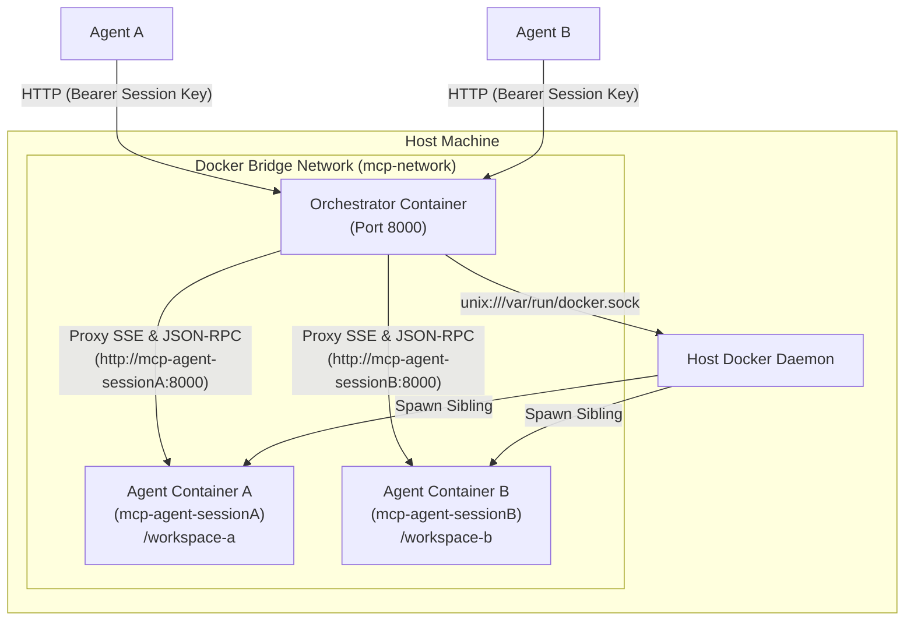

# Phase B: Multi-Tenant Orchestrator

This document outlines the architecture, production topology, and implementation strategy for **Phase B**, which introduces a production-grade multi-tenant Orchestrator. 

Because the Agent Workspace MCP server operates directly on the host's OS resources (filesystem, processes) via the `run_bash` and `write_file` tools, a single HTTP server cannot safely serve multiple independent agents. Phase B solves this by introducing a lightweight API Gateway that spins up an isolated, ephemeral Docker container for each client session.

---

## 1. Architecture Overview

### 1.1 Sibling Container Production Topology
In a production deployment, the Orchestrator itself runs inside a Docker container. Instead of spawning containers *inside* itself (Docker-in-Docker), it uses the **Sibling Containers** pattern by mounting the host's `/var/run/docker.sock`.

To ensure maximum isolation and simplify routing, both the Orchestrator and the spawned agent containers are joined to a dedicated Docker bridge network (`mcp-network`). This avoids exposing any random agent ports on the host's public or loopback interfaces. All traffic is securely routed container-to-container inside the virtual bridge network.



### 1.2 Core Principles
1. **Physical Isolation:** Every session gets its own container, guaranteeing that Agent A cannot see or interfere with Agent B's files, processes, or environment variables.
2. **Zero Host Interface Pollution:** Spawned containers are not bound to host ports. Sibling containers communicate strictly within the internal Docker bridge network.
3. **Asynchronous Stream Proxying:** The API Gateway proxies standard HTTP JSON-RPC calls *and* streams Server-Sent Events (SSE) asynchronously using chunk-by-chunk HTTP streaming.
4. **Shared Nothing Workspaces:** Host directories are created under a secure temp path (`/tmp/mcp-workspaces/*`) and mounted into each container's `/workspace` path.

---

## 2. Components to Build

The Orchestrator is built as a standalone service under `services/orchestrator` using:
- **FastAPI**: For the high-performance HTTP gateway.
- **Docker SDK for Python (`docker`)**: To manage the sibling container lifecycles.
- **httpx**: For both standard proxy requests and streaming SSE event loops.

### 2.1 API Endpoints

1. **`POST /api/sessions`**
   - **Purpose:** Initialize a new session.
   - **Action:** Generates a cryptographically secure `session_id`, creates a workspace directory, generates a unique internal API key, and spawns the sibling container.
   - **Response:** Returns the `session_id` and the gateway authentication token.

2. **`GET /mcp/{session_id}/sse` (Streaming)**
   - **Purpose:** Gateway route proxying FastMCP's SSE registration stream.
   - **Action:** Forwards the SSE subscription request to the target container and streams response chunks in real-time.

3. **`POST /mcp/{session_id}/`**
   - **Purpose:** Gateway route proxying FastMCP's JSON-RPC POST requests.
   - **Action:** Proxies the tool call payload using the session's unique internal key.

4. **`DELETE /api/sessions/{session_id}`**
   - **Purpose:** Cleanly terminate a session.
   - **Action:** Stops the sibling container and recursively deletes the workspace directory.

---

### 2.2 Sibling Container Spawner

The Orchestrator connects to the host's Docker socket and manages containers securely on the shared network:

```python
import os
import secrets
import shutil
import tempfile
import docker

client = docker.from_env()

def spawn_container(session_id: str) -> dict:
    # 1. Create a secure, isolated workspace directory on the host
    # For production running in a container, make sure the base path is shared/mounted
    base_dir = "/tmp/mcp-workspaces"
    os.makedirs(base_dir, exist_ok=True)
    workspace_dir = tempfile.mkdtemp(dir=base_dir, prefix=f"session-{session_id}-")
    
    # Ensure standard permissions
    os.chmod(workspace_dir, 0o777)
    
    # 2. Generate a secure, unique API key for this specific container session
    internal_key = secrets.token_urlsafe(32)
    container_name = f"mcp-agent-{session_id}"
    
    # 3. Start the sibling container inside the same Docker bridge network
    container = client.containers.run(
        image="agent-workspace-mcp:latest",
        name=container_name,
        detach=True,
        network="mcp-network",  # Production custom bridge network
        init=True,
        cap_drop=["ALL"],
        security_opt=["no-new-privileges:true"],
        mem_limit="2g",
        cpu_quota=200000,
        pids_limit=256,
        user="1000:1000",
        tmpfs={"/tmp": "size=64m", "/home/mcpuser/.cache": "size=512m"},
        volumes={workspace_dir: {"bind": "/workspace", "mode": "rw"}},
        environment={
            "MCP_TRANSPORT": "http",
            "MCP_API_KEY": internal_key,
            "MCP_HOST": "0.0.0.0",
            "MCP_PORT": "8000"
        }
    )
    
    return {
        "container_id": container.id,
        "container_name": container_name,
        "internal_key": internal_key,
        "workspace_dir": workspace_dir
    }
```

---

### 2.3 Production SSE and JSON-RPC Proxy

To handle FastMCP's SSE connections correctly without buffering or blocking the event loop, the Orchestrator utilizes FastAPI's `StreamingResponse` with an asynchronous generator:

```python
import httpx
from fastapi import FastAPI, Request, HTTPException, Response
from fastapi.responses import StreamingResponse

app = FastAPI(title="MCP Multi-Tenant Orchestrator")
sessions = {}  # In-memory session registry (production should use Redis/SQLite)

@app.get("/mcp/{session_id}/sse")
async def proxy_sse(session_id: str):
    session = sessions.get(session_id)
    if not session:
        raise HTTPException(status_code=404, detail="Session not found")
        
    # Sibling DNS resolves container name directly within mcp-network
    target_url = f"http://{session['container_name']}:8000/sse"
    headers = {"Authorization": f"Bearer {session['internal_key']}"}
    
    async def event_generator():
        async with httpx.AsyncClient(timeout=None) as client:
            async with client.stream("GET", target_url, headers=headers) as response:
                if response.status_code != 200:
                    yield f"event: error\ndata: Failed to connect to agent stream (status {response.status_code})\n\n"
                    return
                async for chunk in response.aiter_bytes():
                    yield chunk

    return StreamingResponse(
        event_generator(),
        media_type="text/event-stream",
        headers={
            "Cache-Control": "no-cache",
            "Connection": "keep-alive",
            "X-Accel-Buffering": "no"  # Critical for Nginx/Reverse Proxies
        }
    )

@app.post("/mcp/{session_id}/")
async def proxy_jsonrpc(session_id: str, request: Request):
    session = sessions.get(session_id)
    if not session:
        raise HTTPException(status_code=404, detail="Session not found")
        
    target_url = f"http://{session['container_name']}:8000/mcp/"
    headers = {
        "Authorization": f"Bearer {session['internal_key']}",
        "Content-Type": "application/json"
    }
    
    body = await request.body()
    
    async with httpx.AsyncClient() as client:
        response = await client.post(target_url, content=body, headers=headers, timeout=60.0)
        return Response(
            content=response.content,
            status_code=response.status_code,
            headers=dict(response.headers)
        )
```

---

### 2.4 The Garbage Collector (Reaper)

To prevent container or workspace leaks, an asynchronous background loop monitors activity:

```python
import asyncio
import time
import logging

logger = logging.getLogger("orchestrator.reaper")

async def session_reaper_loop(interval_seconds: int = 60, max_inactivity_seconds: int = 1800):
    """Periodically scans sessions and prunes idle ones."""
    while True:
        await asyncio.sleep(interval_seconds)
        now = time.time()
        
        expired_ids = []
        for session_id, session in list(sessions.items()):
            inactive_duration = now - session["last_accessed"]
            if inactive_duration > max_inactivity_seconds:
                logger.info("Session %s idle for %ds, marking for cleanup.", session_id, inactive_duration)
                expired_ids.append(session_id)
                
        for session_id in expired_ids:
            try:
                await terminate_session(session_id)
            except Exception as e:
                logger.error("Failed to prune session %s: %s", session_id, str(e))

async def terminate_session(session_id: str):
    session = sessions.pop(session_id, None)
    if not session:
        return
        
    # 1. Stop and remove Docker container
    try:
        container = client.containers.get(session["container_name"])
        container.stop(timeout=5)
        container.remove(force=True)
    except docker.errors.NotFound:
        pass
        
    # 2. Recursively delete temp workspace
    workspace = session["workspace_dir"]
    if os.path.exists(workspace):
        shutil.rmtree(workspace, ignore_errors=True)
```

---

## 3. Production Deployment Plan

To deploy this in production, create a parent `docker-compose.yml` to set up the network, cache directories, and orchestrator gateway:

### 3.1 `docker-compose.yml`
```yaml
version: "3.8"

networks:
  mcp-network:
    name: mcp-network
    driver: bridge

services:
  orchestrator:
    build:
      context: .
      dockerfile: services/orchestrator/Dockerfile
    container_name: mcp-orchestrator
    restart: always
    networks:
      - mcp-network
    ports:
      - "8000:8000"
    volumes:
      # Sibling Container Mounting: access host Docker socket
      - /var/run/docker.sock:/var/run/docker.sock
      # Shared workspace directory on host
      - /tmp/mcp-workspaces:/tmp/mcp-workspaces
    environment:
      - ORCHESTRATOR_API_KEY=super-secret-gateway-key
      - BASE_WORKSPACE_DIR=/tmp/mcp-workspaces
```

---

## 4. End-to-End Client Usage Example

Here is a complete Python client utilizing `httpx` and `fastmcp`'s client transport to interact with the multi-tenant Orchestrator:

```python
import asyncio
import httpx
from fastmcp import Client
from fastmcp.client.transports import SSETransport

GATEWAY_URL = "http://127.0.0.1:8000"
GATEWAY_KEY = "super-secret-gateway-key"

async def run_agent_workflow():
    headers = {"Authorization": f"Bearer {GATEWAY_KEY}"}
    
    # 1. Initialize an isolated session via API Gateway
    async with httpx.AsyncClient() as http_client:
        print("🚀 Initializing isolated agent session...")
        response = await http_client.post(
            f"{GATEWAY_URL}/api/sessions",
            headers=headers,
            json={"session_timeout": 1800}
        )
        response.raise_for_status()
        session_data = response.json()
        session_id = session_data["session_id"]
        print(f"✅ Session established! ID: {session_id}")
        
    try:
        # 2. Connect the FastMCP Client to the session's SSE proxy endpoint
        # SSETransport passes gateway headers to authenticate with the proxy
        print("🔌 Connecting client transport over SSE proxy...")
        transport = SSETransport(
            url=f"{GATEWAY_URL}/mcp/{session_id}/sse",
            headers=headers
        )
        
        async with Client(transport) as mcp_client:
            print("🔗 Connected! Executing tools in isolated container...")
            
            # Example 1: Write a file to the sandbox
            write_res = await mcp_client.call_tool(
                "write_file",
                {"path": "hello.txt", "content": "Hello from Multi-Tenant Client!"}
            )
            print("Write Tool Output:", write_res)
            
            # Example 2: Run a shell command in the container
            bash_res = await mcp_client.call_tool(
                "run_bash",
                {"command": "uname -a && cat hello.txt"}
            )
            print("Bash Tool Output:", bash_res)
            
    finally:
        # 3. Cleanly close and destroy the session
        async with httpx.AsyncClient() as http_client:
            print("🧹 Terminating and deleting session container/workspace...")
            cleanup_res = await http_client.delete(
                f"{GATEWAY_URL}/api/sessions/{session_id}",
                headers=headers
            )
            if cleanup_res.status_code == 200:
                print("✨ Ephemeral workspace cleanly destroyed.")

if __name__ == "__main__":
    asyncio.run(run_agent_workflow())
```
