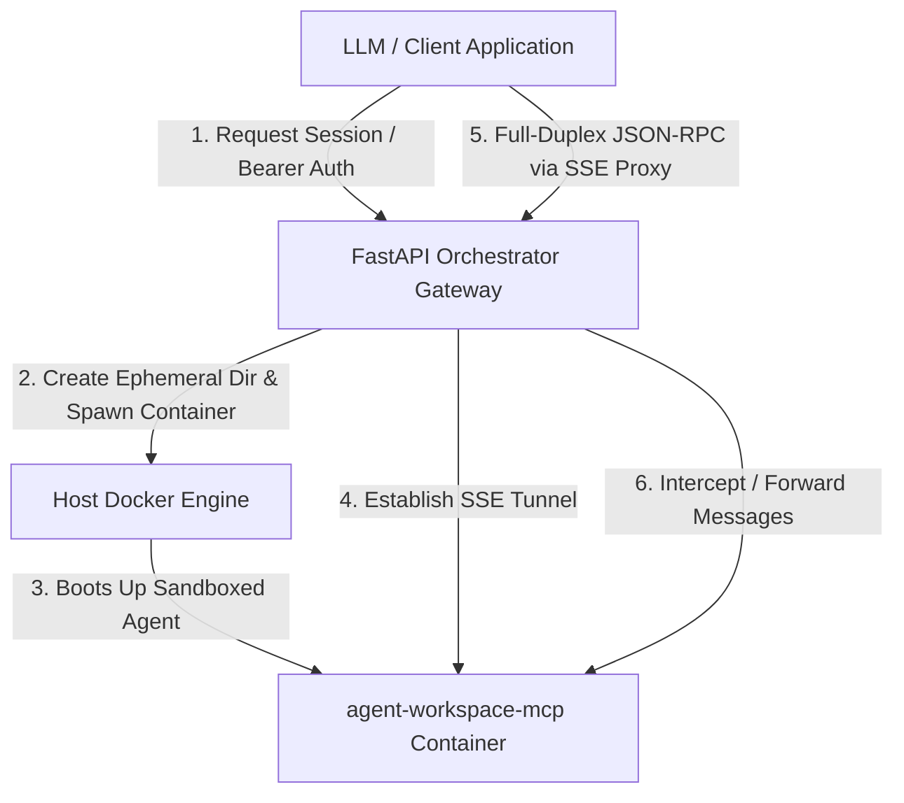

# MCP Multi-Tenant Orchestrator

A high-performance, FastAPI-based multi-tenant API Gateway and session manager designed to orchestrate and spawn sandboxed, ephemeral `agent-workspace-mcp` containers on the fly. 

This orchestrator is specifically designed to handle multi-tenant LLM environments where each session gets its own isolated, secure agent environment connected via standard Model Context Protocol (MCP) HTTP/SSE transport.

---

## Key Features

1. **On-Demand Ephemeral Environments**: Spawns isolated container workspaces instantly on host docker engines.
2. **Secure SSE Tunneling**: Proxies full-duplex JSON-RPC communications directly to the target container over a shared Docker virtual bridge network.
3. **Advanced Security Hardening**:
   - Least privilege Docker container settings (e.g. read-only filesystem, cap-drops, no-new-privileges).
   - Micro-isolation via unique sandbox execution tokens for each tenant session.
   - Distinct unprivileged user execution boundaries.
4. **Automatic Idle Session Garbage Collection**: A background session reaper monitors and prunes stale workspaces based on custom inactivity thresholds.
5. **Zero-Overhead Base Image Reuse**: The orchestrator is built on the same base Python-slim image and uv version as the agent containers to maximize host layer sharing and minimize build sizes.

---

## System Architecture



---

## Configuration & Environment Variables

The orchestrator is fully configurable via the environment. Below are the key environment settings:

| Variable Name | Default Value | Description |
|---|---|---|
| `ORCHESTRATOR_API_KEY` | `super-secret-gateway-key` | Authentication key required by client apps to talk to the gateway. |
| `ORCHESTRATOR_MODE` | `production` | Mode of execution. Use `production` for container-to-container network bridge or `development` for local host port bindings. |
| `DOCKER_NETWORK` | `mcp-network` | The Docker bridge network to connect the spawned agent containers. |
| `AGENT_IMAGE` | `agent-workspace-mcp:latest` | The container image used to spawn individual agent workspaces. |
| `SESSION_TIMEOUT_SECONDS`| `1800` (30 mins) | Time of inactivity after which the session is automatically garbage-collected and destroyed. |
| `BASE_WORKSPACE_DIR` | `/tmp/mcp-workspaces` | The folder on the host machine where isolated ephemeral workspace folders are mounted. |

---

## Production Security Hardening

The orchestrator contains state-of-the-art container-level security configurations:

- **Immutable Runtime**: The Orchestrator Docker image runs with `read_only: true` for the root filesystem, supplemented by ephemeral, size-constrained `tmpfs` RAM-mounts for `/tmp` and `/home/orchestrator`.
- **No-Root Execution**: Runs strictly as an unprivileged non-root user (`orchestrator` with UID/GID `10001`).
- **Capability Stripping**: Drops all system capabilities (`cap_drop: [ALL]`) to restrict operating system-level interventions.
- **Process Cap**: Enforces a strict PIDs limit (`pids_limit: 100`) to prevent fork-bomb Denial of Service (DoS) attacks.
- **Resource Constraints**: Capped at 1.0 CPU cores and 512MB RAM in the sample `docker-compose.yml` to prevent rogue sessions from impacting other host processes.

---

## Local Verification & Development

To run unit tests for the orchestrator, navigate to this directory and run:

```bash
uv run pytest -v
```

To run end-to-end integration tests (which spin up a real docker container and verify full-duplex proxying), run from the workspace root:

```bash
uv run pytest tests/integration/test_orchestrator_integration.py -v -s
```
